title: Data Visualization
transition: slide

---

bgcolor: white

---

关于我

* 马源英
* 奇舞团前端工程师

---

# Data Visualization

---

fragment: true

## What Is Data Visualization

Data Visualization is the study of the VISUAL representation of DATA.

---
bgcolor: white

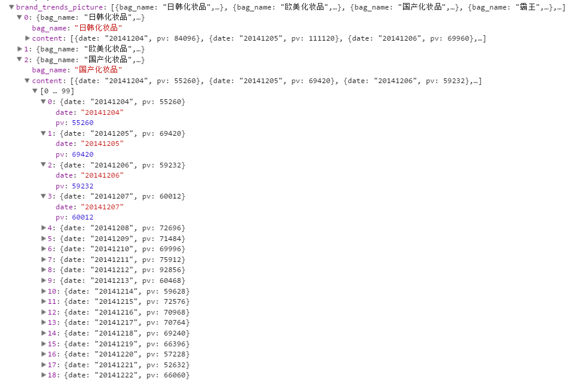

---
bgcolor: white

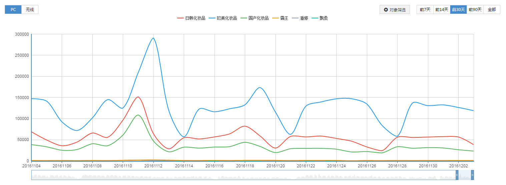

---

fragment: true

## Data types

* something you can count
* something you can order
* something you can just differentiate

---

fragment: true

* Quantitative
  * Duration in days: 1, 4, 23333

* Ordered / Qualitative
  * Bug Severity: Blocking, Average, Who Cares

* Categorical
  * Fruits: Apples, Oranges, Banana

---

## Visual Encoding Variables

---

fragment: true

## Location

---

fragment: true

## Size

---

fragment: true

## Texture

---

fragment: true

## Shape

---

fragment: true

## Orientation

---

fragment: true

## Color

  
  
  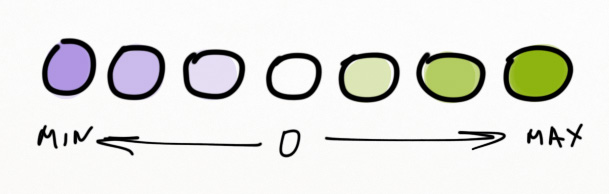

---

bgcolor: white

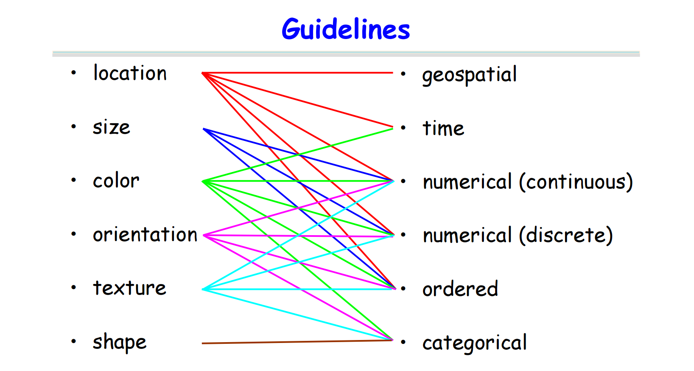

---

## Diagram Categories

---

bgcolor:#f3f3f3

iframe(src="http://echarts.baidu.com/gallery/view.html?c=line-aqi&reset=1&edit=1" fullscreen)

---

iframe(src="http://echarts.baidu.com/gallery/view.html?c=mix-line-bar&reset=1&edit=1" fullscreen)

---

iframe(src="http://echarts.baidu.com/gallery/view.html?c=pie-simple&reset=1&edit=1" fullscreen)

---

iframe(src="http://echarts.baidu.com/gallery/view.html?c=scatter-aqi-color&reset=1&edit=1" fullscreen)

---

iframe(src="http://echarts.baidu.com/gallery/view.html?c=radar&reset=1&edit=1" fullscreen)

---

iframe(src="http://echarts.baidu.com/gallery/view.html?c=graph-npm&reset=1&edit=1" fullscreen)

---

iframe(src="http://echarts.baidu.com/gallery/view.html?c=treemap-obama&reset=1&edit=1" fullscreen)

---

iframe(src="http://echarts.baidu.com/gallery/view.html?c=lines-airline&reset=1&edit=1" fullscreen)

---

## Some Data Visualization Practices

---

iframe(src="https://www.google.com/publicdata/embed?ds=d5bncppjof8f9_&amp;ctype=b&amp;strail=false&amp;bcs=d&amp;nselm=s&amp;met_x=sp_dyn_tfrt_in&amp;scale_x=lin&amp;ind_x=false&amp;met_s=sp_pop_totl&amp;scale_s=lin&amp;ind_s=false&amp;dimp_c=country:region&amp;met_y=sp_dyn_le00_in&amp;scale_y=lin&amp;ind_y=false&amp;ifdim=country&amp;tunit=Y&amp;pit=1417363200000&amp;hl=en_US&amp;dl=en_US&amp;ind=false&amp;icfg&amp;iconSize=0.5" fullscreen)

---

bgcolor: white

## <h2 style="color: #000;">Charles Joseph Minard</h2>

---

fragment: true

## Nightingale rose diagram

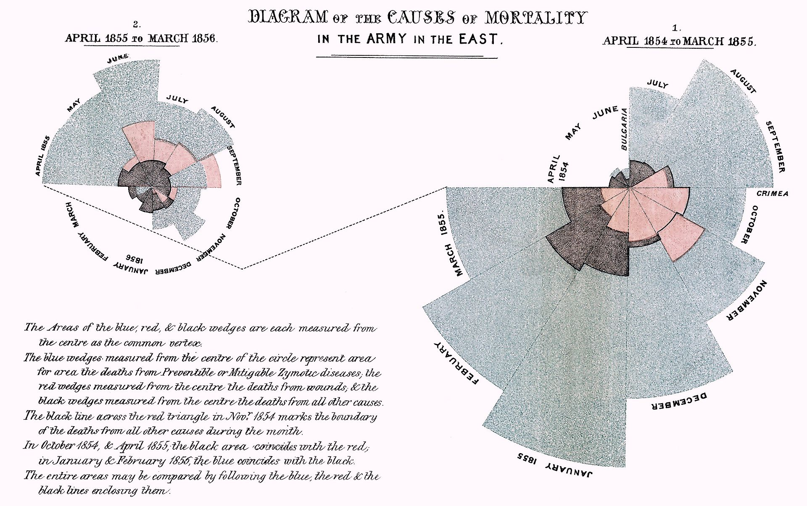

---

bgcolor: white

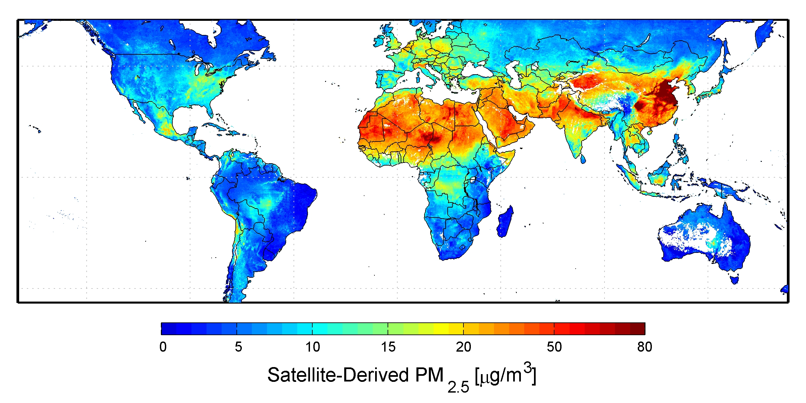

---

bgcolor: white

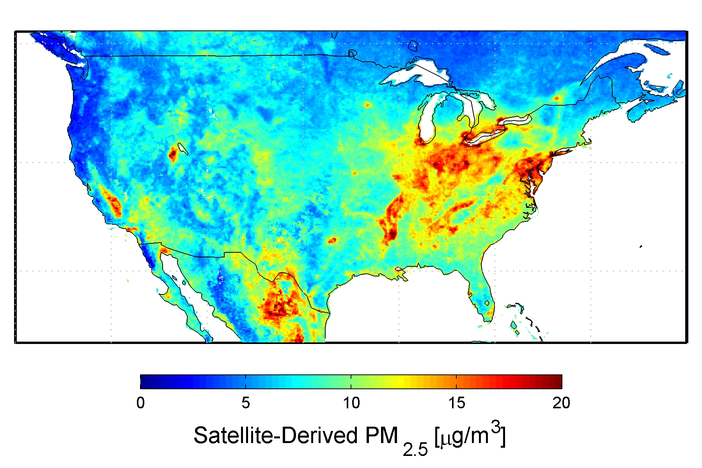

---

bgcolor: #f2f2f2

<video controls src="/slides/data/img/air.webm" autoplay loop></video>

---

bgcolor: white

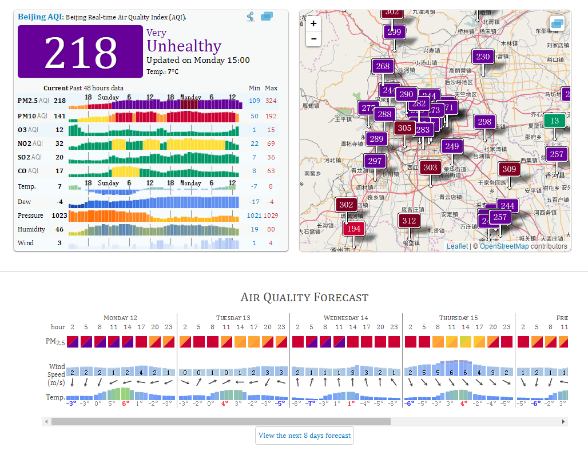

---

## π

3.14159265358979323846264338327950288419716939937510582097494459230781640628620899862803482534211706798214808651328230664709384460955058223172535940812848111745028410270193852110555964462294895493038196442881097566593344612847564823378678316527120190914564856692346034861045432664821339360726024914127372458700660631558817488152092096282925409171536436789259036001133053054882046652138414695194151160943305727036575959195309218611738193261179310511854807446237996274956735188575272489122793818301194912983367336244065664308602139494639522473719070217986094370277053921717629317675238467481846766940513200056812714526356082778577134275778960917363717872146844090122495343014654958537105079227968925892354201995611212902196086403441815981362977477130996051870721134999999837297804995

---

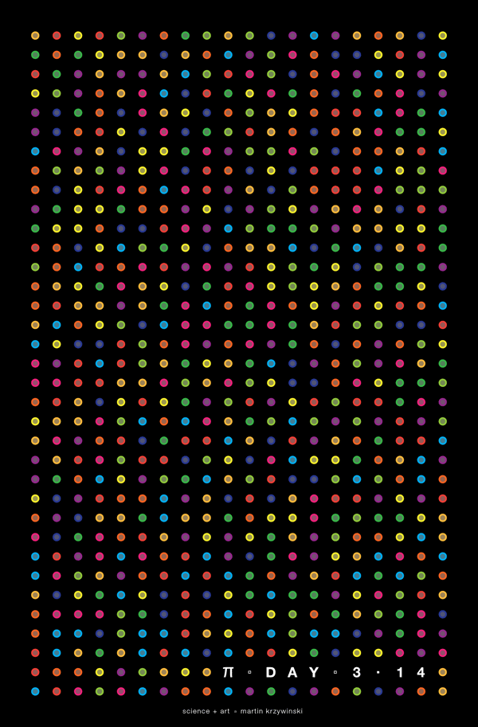

---

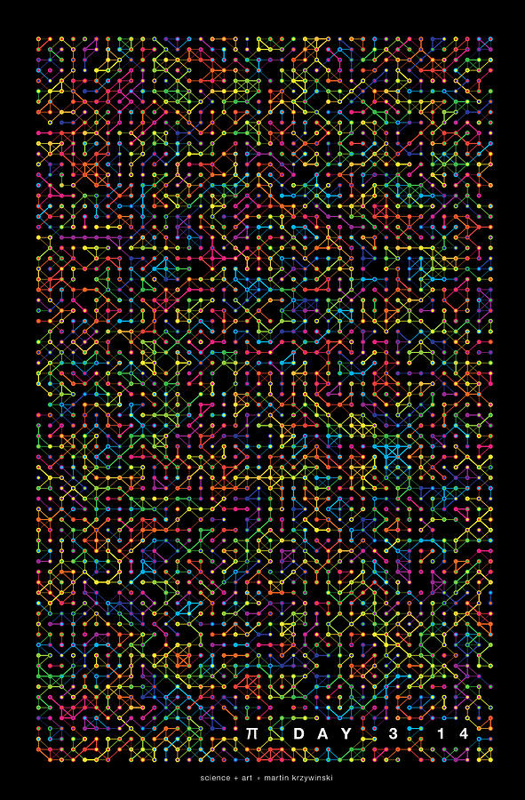

---

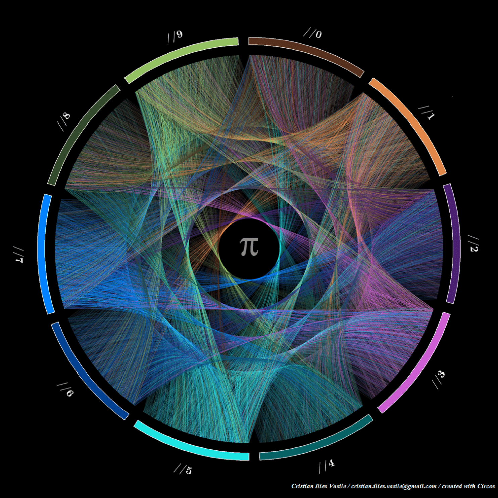

---

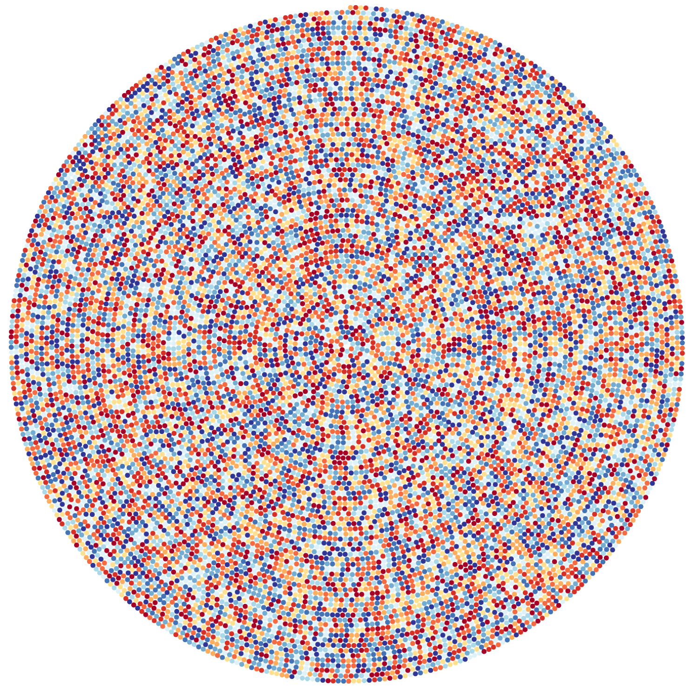

---

bgcolor:#f0ebe7

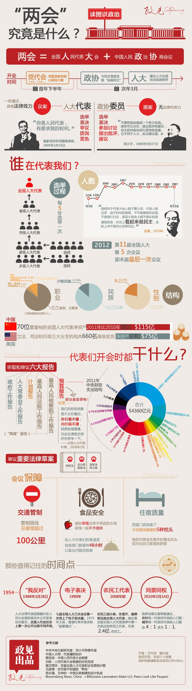

---

## How to Lie with Data Visualization

---

bgcolor: white

---

bgcolor: white

---

bgcolor: white

  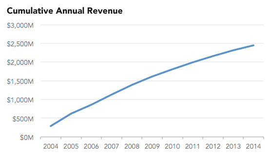
  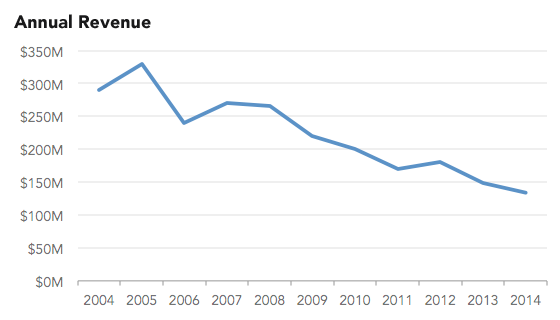

---

bgcolor: white

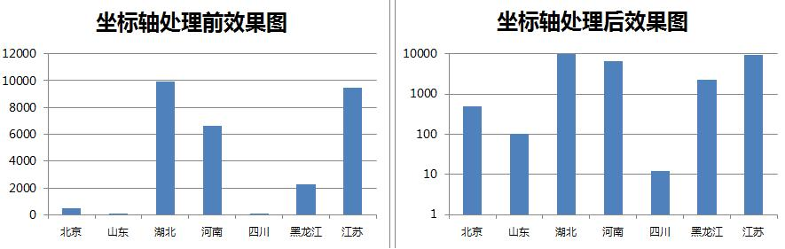

---

bgcolor: white

  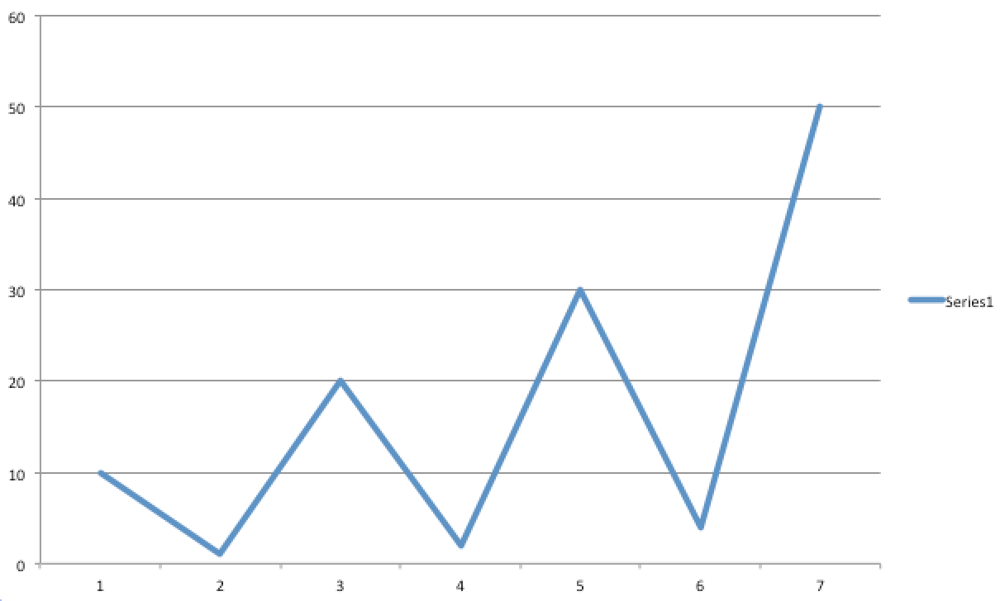
  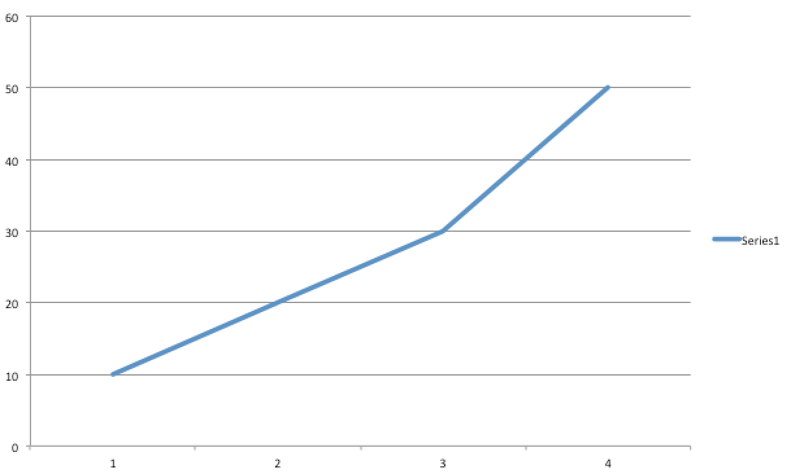

---

## Worth of Data Visualization

---

iframe(src="http://shangyi.360.cn/report/brand_develop/24051" fullscreen)

---

iframe(src="https://fenxi.360.cn/report/overview?domainId=31145" fullscreen)

---

## What Makes A Good Data Visualization

---

bgcolor: white

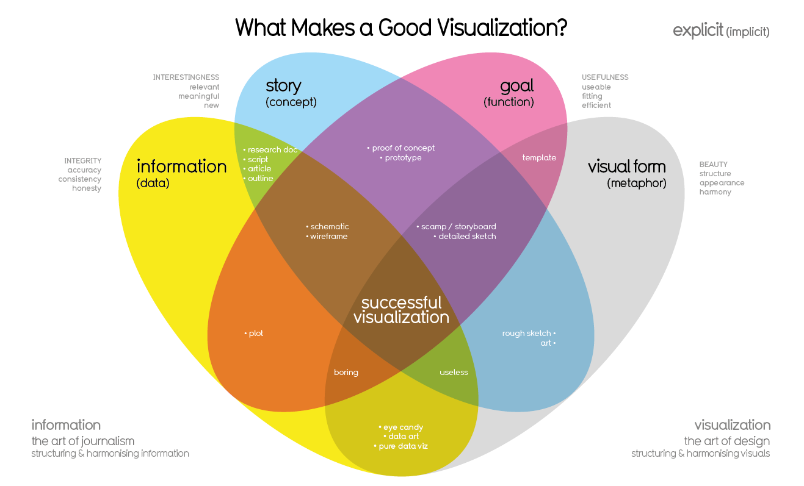

---

bgcolor:#fcf0e4

---

### References

[http://www.worldbank.org/](http://www.worldbank.org/)
[https://www.google.com/publicdata/directory](https://www.google.com/publicdata/directory)
[https://robots.thoughtbot.com/analyzing-minards-visualization-of-napoleons-1812-march](https://robots.thoughtbot.com/analyzing-minards-visualization-of-napoleons-1812-march)
[http://data.163.com/16/1025/04/C46RL0O1000181IU.html](http://data.163.com/16/1025/04/C46RL0O1000181IU.html)
[https://en.wikipedia.org/wiki/Florence_Nightingale](https://en.wikipedia.org/wiki/Florence_Nightingale)
[https://www.targetprocess.com/articles/visual-encoding/](https://www.targetprocess.com/articles/visual-encoding/)
[http://www.informationisbeautiful.net/visualizations/what-makes-a-good-data-visualization/](http://www.informationisbeautiful.net/visualizations/what-makes-a-good-data-visualization/)
[https://www.visualnews.com/2016/08/22/evolution-web-interactive/](https://www.visualnews.com/2016/08/22/evolution-web-interactive/)
[https://robots.thoughtbot.com/analyzing-minards-visualization-of-napoleons-1812-march](https://robots.thoughtbot.com/analyzing-minards-visualization-of-napoleons-1812-march)
[https://www.nasa.gov/topics/earth/features/health-sapping.html](https://www.nasa.gov/topics/earth/features/health-sapping.html)
[https://www.washingtonpost.com/news/wonk/wp/...](https://www.washingtonpost.com/news/wonk/wp/2015/03/14/10-stunning-images-show-the-beauty-hidden-in-pi/?utm_term=.78063dabc223)
[https://en.wikipedia.org/wiki/French_invasion_of_Russia](https://en.wikipedia.org/wiki/French_invasion_of_Russia)
[http://data.heapanalytics.com/how-to-lie-with-data-visualization](http://data.heapanalytics.com/how-to-lie-with-data-visualization)
[https://www.targetprocess.com/articles/visual-encoding/](https://www.targetprocess.com/articles/visual-encoding/)
[https://antv.alipay.com/chart/classify/compare.html](https://antv.alipay.com/chart/classify/compare.html)
[http://echarts.baidu.com](http://echarts.baidu.com)
[http://aqicn.org/city/beijing/](http://aqicn.org/city/beijing/)

---

bgcolor:white

